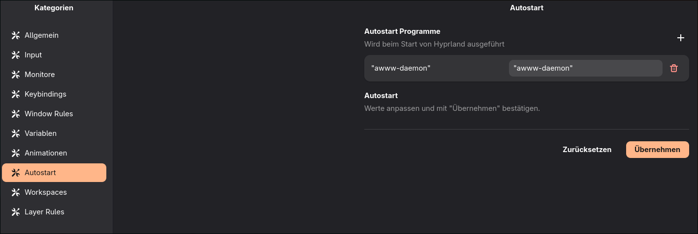
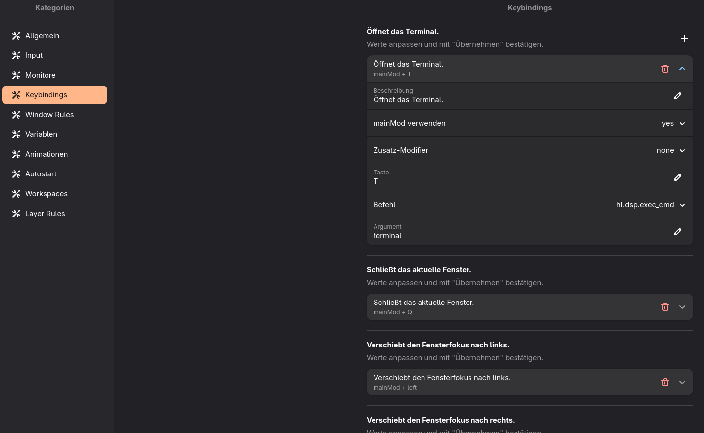
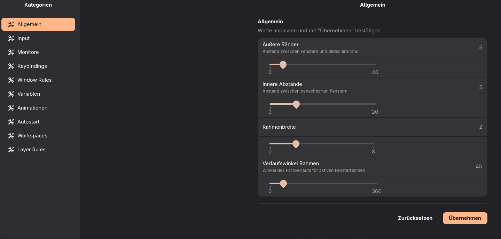
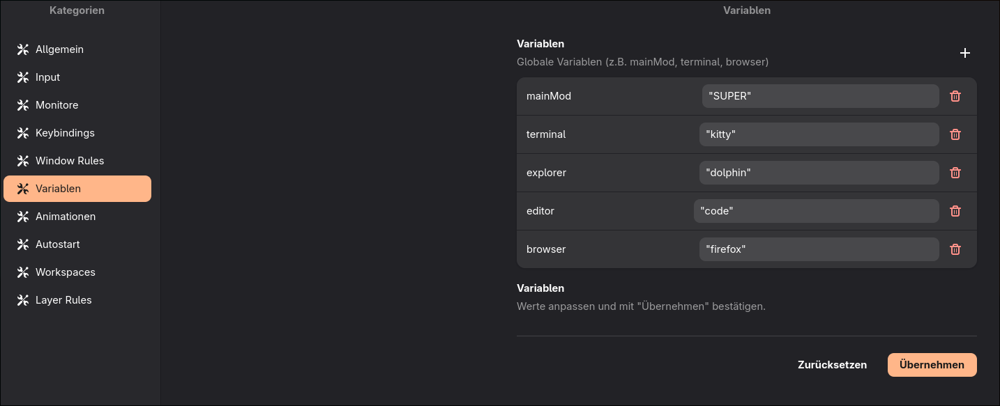
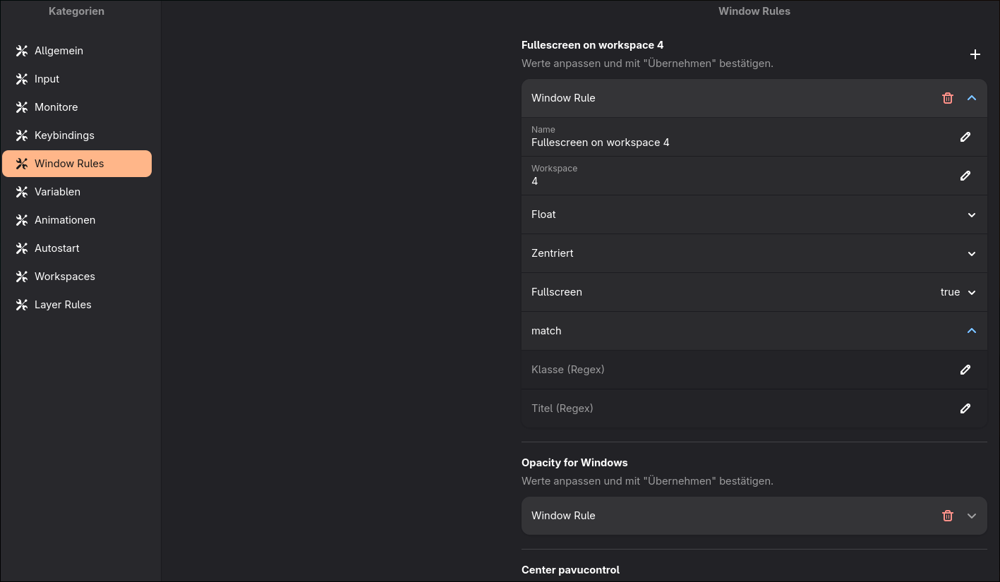

# settings_mask

Eine GTK4/Libadwaita Settings-Maske für **Hyprland v0.55+ Lua-Konfigurationen**.  
Alle Einstellungen werden über eine `settings.ini` gesteuert – kein Python-Kenntnisse nötig um neue Einstellungen hinzuzufügen.

---

## Screenshots

> Sidebar-Navigation links, Einstellungen rechts, Matugen-Farbschema automatisch übernommen.





---

## Voraussetzungen

```bash
sudo pacman -S python-gobject libadwaita
```

Optional für automatisches Theming:
```bash
# Matugen muss colors.css generiert haben unter:
~/.themes/Matugen/gtk-4.0/colors.css
```

---

## Installation

```bash
git clone https://github.com/DEINUSER/settings_mask
cd settings_mask
chmod +x settings_mask.py
```

`settings.ini` anpassen (Pfade auf eigene Hyprland-Konfiguration setzen) und starten:

```bash
./settings_mask.py settings.ini
```

---

## Was macht das Tool?

`settings_mask` ist eine grafische Oberfläche für Hyprland-Lua-Konfigurationsdateien.  
Es liest die Konfigurationsdateien direkt ein, zeigt die Werte in einer strukturierten UI an und schreibt Änderungen **in-place** zurück – ohne den Rest der Datei zu verändern.

Unterstützt werden:

- Einfache Zahlenwerte (Slider)
- Auswahllisten (Dropdown)
- Mehrfach-Einstellungen mit beliebig vielen Feldern (Keybinds, Window Rules, etc.)
- Globale Variablen (`KEY = VALUE`)
- Autostart-Einträge
- Animationen, Workspace Rules, Layer Rules
- Neue Einträge anlegen und bestehende löschen

Das Farbschema wird automatisch aus Matugen geladen. Dark Mode ist immer aktiv.

---

## Aufbau der `settings.ini`

Jede Sektion in der INI entspricht einer Einstellung oder Gruppe von Einstellungen.  
Alle Pfade müssen absolut angegeben werden.

### Allgemeine Felder

| Feld | Bedeutung |
|------|-----------|
| `category` | Sidebar-Kategorie (gleicher Name = gleiche Seite) |
| `label` | Anzeigename in der Maske |
| `description` | Optionaler Untertitel |
| `type` | Feldtyp (siehe unten) |
| `config_file` | Pfad zur Lua-Datei die gelesen/geschrieben wird |
| `config_key` | Key der in der Datei gesucht wird |
| `format` | Schreibformat: `lua` (Zahl) oder `lua_string` (String mit `"`) |
| `visible` | `false` blendet die Sektion aus der UI aus (für Templates) |

---

## Feldtypen

### `type = slider`

Zeigt einen Schieberegler. Beim Klick auf „Übernehmen" wird der Wert in die Datei geschrieben.

```ini
[gaps_out]
category     = Allgemein
label        = Äußere Ränder
description  = Abstand zwischen Fenstern und Bildschirmrand
type         = slider
min          = 0
max          = 40
step         = 1
config_file  = /home/user/.config/hypr/general.lua
config_key   = gaps_out
format       = lua
```

Lua-Datei vorher:
```lua
gaps_out = 10,
```
Nach Änderung auf 20:
```lua
gaps_out = 20,
```

**Zusatzfelder:**

| Feld | Bedeutung |
|------|-----------|
| `min` | Minimalwert |
| `max` | Maximalwert |
| `step` | Schrittweite |
| `parent_key` | Sucht den Key nur innerhalb dieses Lua-Blocks (z.B. `input`) |

---

### `type = dropdown`

Zeigt ein Auswahlmenü mit vordefinierten Werten.

```ini
[accel_profile]
category     = Input
label        = Beschleunigungsprofil
type         = dropdown
options      = flat, adaptive, custom
config_file  = /home/user/.config/hypr/general.lua
config_key   = accel_profile
parent_key   = input
format       = lua_string
```

**Zusatzfelder:**

| Feld | Bedeutung |
|------|-----------|
| `options` | Kommagetrennte Liste der Auswahlmöglichkeiten |
| `parent_key` | Sucht nur innerhalb dieses Lua-Blocks |

---

### `type = multisetting`

Zeigt einen aufklappbaren Eintrag mit mehreren Feldern. Wird für Keybinds, Window Rules, Animationen, Workspace Rules und Layer Rules verwendet.  
Jeder Eintrag in der Datei bekommt eine eigene Row (identifiziert über `index_field`).

```ini
[keybinds_view]
category     = Keybindings
label        = Keybind bearbeiten
type         = multisetting
config_file  = /home/user/.config/hypr/keybindings.lua
config_key   = description
index_field  = description
index_value  =
format       = lua_string
fields       = [
    {"key": "description", "label": "Beschreibung",      "type": "text"},
    {"key": "use_mainmod", "label": "mainMod verwenden", "type": "dropdown", "options": ["yes", "no"]},
    {"key": "modifier",    "label": "Zusatz-Modifier",   "type": "dropdown", "options": ["none", "CTRL", "ALT", "SHIFT", "SUPER"]},
    {"key": "key",         "label": "Taste",             "type": "text"},
    {"key": "command",     "label": "Befehl",            "type": "dropdown", "options": ["hl.dsp.exec_cmd", "hl.dsp.window.close"]},
    {"key": "argument",    "label": "Argument",          "type": "text"}
  ]
```

**Zusatzfelder:**

| Feld | Bedeutung |
|------|-----------|
| `index_field` | Key der jeden Block eindeutig identifiziert (z.B. `description`, `name`, `leaf`) |
| `index_value` | Gezielter Wert (z.B. `DP-1`). Leer = alle Vorkommen automatisch einlesen |
| `lua_func` | Lua-Funktion für den Builder (z.B. `hl.animation`, `hl.workspace_rule`) |
| `fields` | JSON-Array der editierbaren Felder (siehe unten) |
| `new_template` | Template für neue Einträge: `__keybind__`, `__windowrule__`, `__lua_func__` |
| `append_file` | Datei an die neue Einträge angehängt werden |

#### `fields` JSON-Format

Jedes Feld im Array unterstützt:

| Key | Bedeutung |
|-----|-----------|
| `key` | Lua-Key in der Datei |
| `label` | Anzeigename in der UI |
| `type` | `text` oder `dropdown` |
| `options` | Nur bei `dropdown`: Liste der Auswahlmöglichkeiten |
| `block` | Gruppiert das Feld in einen Lua-Subblock (z.B. `"block": "match"` → `match = { class = "..." }`) |

#### `block`-Felder

Felder mit demselben `block`-Namen werden in der UI gruppiert (eingerückte ExpanderRow mit dem Block-Namen als Überschrift) und im Lua-Output in einem Subblock zusammengefasst:

```ini
fields = [
    {"key": "name",  "label": "Name",           "type": "text"},
    {"key": "class", "label": "Klasse (Regex)", "type": "text", "block": "match"},
    {"key": "title", "label": "Titel (Regex)",  "type": "text", "block": "match"},
    {"key": "blur",  "label": "Blur",           "type": "dropdown", "options": ["", "true", "false"]}
  ]
```

Erzeugt:
```lua
hl.layer_rule({ name = "Test", match = { class = "^rofi$", title = "launcher" }, blur = true })
```

---

### `type = variable`

Liest alle `KEY = VALUE` Zeilen aus der Datei ein. Jede Variable bekommt eine eigene Row mit Eingabefeld. Werte werden exakt so geschrieben wie eingegeben – `"kitty"` mit Anführungszeichen bleibt `"kitty"`.

```ini
[variables]
category     = Variablen
label        = Variablen
type         = variable
config_file  = /home/user/.config/hypr/variables.lua
```

Neue Variablen können per `+` angelegt, bestehende per Mülltonne gelöscht werden.

---

### `type = autostart`

Liest alle `hl.exec_cmd(...)` Zeilen innerhalb von `hl.on("hyprland.start", ...)` ein. Neue Einträge werden vor `end)` eingefügt.

```ini
[autostart]
category     = Autostart
label        = Autostart Programme
type         = autostart
config_file  = /home/user/.config/hypr/autostart.lua
```

---

## Neue Einträge anlegen

Für `multisetting`-Typen wird per `+`-Button ein Dialog geöffnet. Damit das funktioniert, muss eine zweite Sektion mit `visible = false` und `new_template` existieren:

```ini
[keybinds_new]
visible      = false
category     = Keybindings
type         = multisetting
config_file  = /home/user/.config/hypr/keybindings.lua
append_file  = /home/user/.config/hypr/keybindings.lua
new_template = __keybind__
fields       = [ ... ]  # gleiche fields wie _view Sektion
```

#### Verfügbare Templates

| `new_template` | Verwendet für |
|----------------|---------------|
| `__keybind__` | `hl.bind(...)` Keybinds |
| `__windowrule__` | `hl.window_rule({...})` Window Rules |
| `__lua_func__` | Alle einzeiligen `hl.xxx({...})` Calls (Animationen, Workspace Rules, Layer Rules, etc.) |

Bei `__lua_func__` muss zusätzlich `lua_func` gesetzt sein:

```ini
new_template = __lua_func__
lua_func     = hl.workspace_rule
```

---

## Block-Suche in verschachtelten Lua-Strukturen

Steht ein Key nicht am Zeilenanfang sondern innerhalb eines Lua-Blocks, gibt es zwei Mechanismen:

**`parent_key`** – sucht den Key nur innerhalb des angegebenen Blocks:
```ini
config_key   = sensitivity
parent_key   = input
```
Findet `sensitivity` nur innerhalb von `input = { ... }`.

**`index_field` + `index_value`** – identifiziert den Block über einen eindeutigen Wert:
```ini
index_field  = output
index_value  = DP-1
```
Findet den Block in dem `output = "DP-1"` steht und sucht/schreibt dort.

---

## Matugen-Integration

Das Tool lädt automatisch `colors.css` aus folgenden Pfaden (erster gefundener wird verwendet):

```
~/.themes/Matugen/gtk-4.0/colors.css
~/.cache/matugen/colors.css
~/.config/matugen/colors.css
```

Accent-Farbe, Slider-Highlight, „Übernehmen"-Button und die aktive Sidebar-Kategorie werden mit der Matugen-Primärfarbe eingefärbt. Ohne `colors.css` läuft das Tool mit Adwaita Dark.

---

## Datei-Sicherheit

Alle Schreiboperationen werden **in-place** durchgeführt (`open("r+")` + `seek(0)` + `truncate()`). Der Inode der Datei bleibt erhalten, damit Hyprland die Änderungen via inotify sofort erkennt und die Konfiguration neu lädt.

---

## Erweiterbarkeit

Neue Einstellungstypen lassen sich **ausschließlich über die INI** hinzufügen, solange die Lua-Syntax einzeilig und flach ist (`hl.xxx({ key = val, ... })`).  
Verschachtelte Subblocks werden über `"block": "blockname"` in den `fields` definiert.

Für Sonderformate wie `hl.bind()` (mit `..`-Verkettung) oder mehrzeilige Blöcke ist eine Erweiterung des Scripts nötig.

---

## Lizenz

MIT
